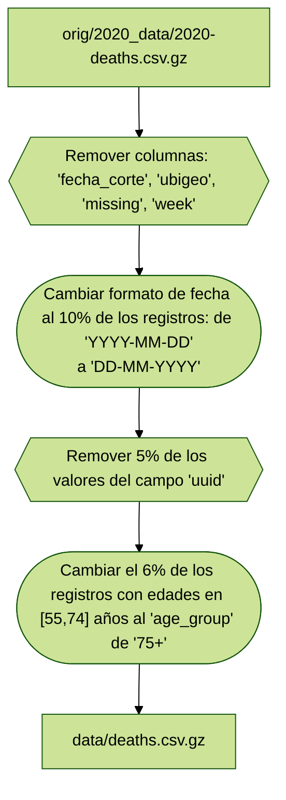

# Workshop 3 - Taller de análisis de sistemas de salud

## Datos

- Originales [data/2020-data/*csv.gz](data/2020-data/): Del año 2020 de COVID-19 de Perú.
- Procesados [data/*csv.gz](data/): Datos procesados para el taller.

## Proceso

### Fallecidos

Referencia: [processing_scripts/processing_deaths.R](processing_scripts/processing_deaths.R)

Sólo se consideró como numérico el campo `edad_declarada`, el resto se consideraron como texto. Además se eliminaron las siguientes columnas:

- `fecha_corte`
- `ubigeo`
- `missing`
- `week`

**Pasos para inclusión de errores**

1. Cambio de fecha: Se muestreó 10% de los registros, y se modificó la fecha del formato "YYYY-MM-DD" a "DD-MM-YYYY" de 10% de los datos.
2. De los datos resultantes, se removieron 5% de los `uuid` de los registros.
3. Finalmente, a los registros con `edad_declarada` en el rango de [55, 74] años, se modificaron 6% de estos poniéndoles un `age_group` (errado) de "75+"

**Datos finales**: [data/deaths.csv.gz](data/deaths.csv.gz)

### Positivos

Referencia: [processing_scripts/processing_positives.R](processing_scripts/processing_positives.R)

Sólo se consideró como numérico el campo `edad`, el resto se consideraron como texto. Además se eliminaron las siguientes columnas:

- `fecha_corte`
- `ubigeo`
- `missing`
- `week`

**Pasos para inclusión de errores**

1. Para un 12% de los registros se cambió el formato de `fecha_resultado` de "YYYY-MM-DD" a "DD-MM-YYYY".
2. De los registros resultantes, para aquellos del `departamento == "AMAZONAS"` se eliminaro el 9% de los valores de `metododx`
3. Finalmente, a un 8% de los registros con `sexo == "FEMENINO"` y `edad > 65` se les removió el `departamento`

**Datos finales**: [data/positivos.csv.gz](data/positivos.csv.gz)

### Hospitalizados

Referencia: [processing_scripts/processing_hospital.R](processing_scripts/processing_hospital.R)

Se consideraron como numéricos los campos de `edad` y `flag_vacuna`, como lógicos los campos: `con_oxigeno`, `con_ventilacion`, `cdc_positividad` y `cdc_fallecido_covid`, mientras que el resto se consideraron como texto. Además se eliminaron las siguientes columnas:

- `eess_renaes`
- `eess_diresa`
- `eess_red`
- `flag_uci`
- `ubigeo_inei_domicilio`
- `missing`

**Pasos para inclusión de errores**

1. Se cambiaron los formatos de los campos `fecha_dosis_1` y `fecha_dosis_3` de "YYYY-MM-DD" a "DD-MM-YYYY".
2. De los registros resultantes, a un 10% de eliminaron valores de `eess_nombre`.
3. Finalmente, a un 2% de los registros de `dep_domicilio == "LIMA"` y `dist_domicilio == "SAN JUAN DE LURIGANCHO"` se les eliminó los valores del campo `prov_domicilio`.

**Datos finales**: [data/hospitalizados.csv.gz](data/hospitalizados.csv.gz)
